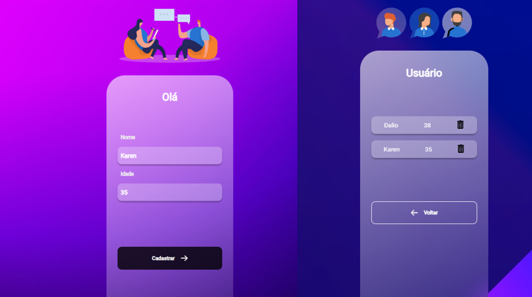

<h1>Projeto Full-Stack: Cadastro de Usuário com React e Node.js</h1> 

Compartilhando meu projeto do curso DevClub!  Criei um sistema de cadastro de usuário com ReactJS no front-end e Node.js no back-end, utilizando Yarn para gerenciamento de dependências.

<h2>
Tecnologias:
</h2>
<ul>
<li>Front-end: ReactJS, Yarn</li>
<li>Back-end: Node.js, Yarn</li>

</ul>

<h2>
Funcionalidades:
</h2>

Cadastro de usuário com Nome e idade

<h2>
O que aprendi:
</h2>
<ul>
<li>Desenvolvimento full-stack com React e Node</li>
<li>Gerenciamento de dependências com Yarn</li>
<li>Adição e exclusão de usuários</li>
</ul>

<h2>
Contatos:
</h2>

>GitHub: https://github.com/DalioSY/react-1

>Linkedin: https://www.linkedin.com/in/dalio-s-yamada/

Se gostou dê uma curtida 👍. 

#reactjs #nodejs #javascript #fullstack #desenvolvimentoweb #yarn #cadastrodeusuario #github #Programação #DesenvolvimentoWeb

<video src="./src/assets/video-web.mp4" loop autoplay></video>
